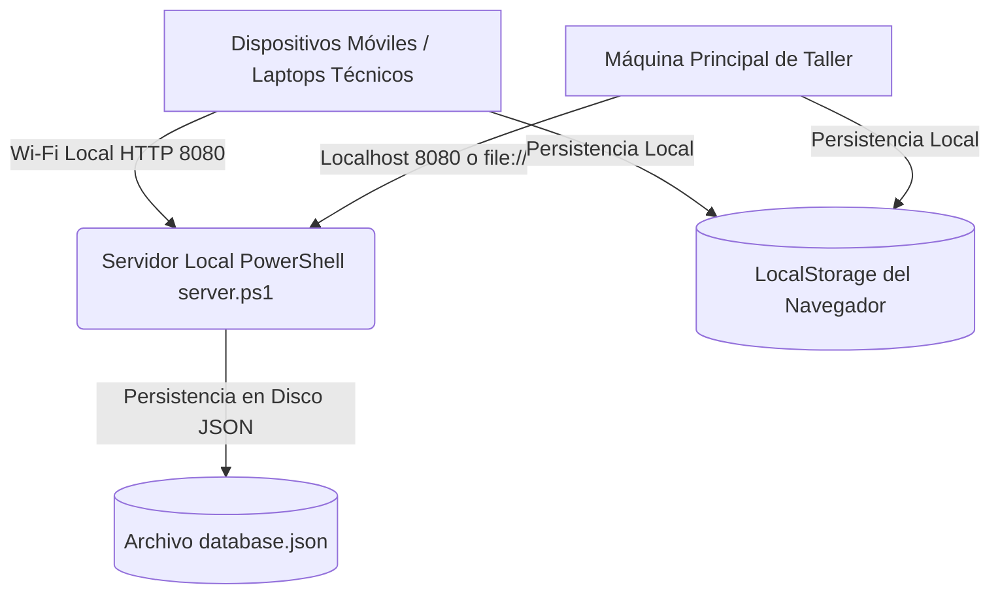
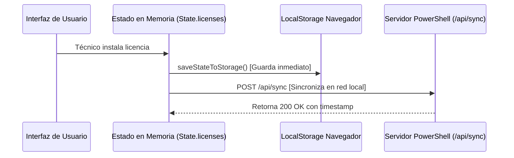

# ⚙️ Funcionamiento del Sistema — Activación WinPro

Este documento técnico explica la arquitectura, el flujo de datos y los mecanismos internos que hacen funcionar el sistema **Activación WinPro**.

---

## 🏛️ 1. Arquitectura General

El sistema está diseñado bajo una arquitectura **SPA (Single-Page Application)** autónoma y resiliente:



### Componentes Clave:
1. **Frontend Autónomo (`index.html`):** Contiene la estructura completa (HTML), los estilos y animaciones (CSS) y toda la lógica de negocio (JavaScript). No depende de CDNs externos para operar en el taller; librerías como `jsbarcode.min.js` están empaquetadas localmente.
2. **Servidor HTTP Local (`server.ps1`):** Servidor ligero escrito en PowerShell nativo de Windows (sin requerir Node.js, Python o Apache).
3. **Lanzador Rápido (`iniciar-servidor.bat`):** Script por lotes que levanta el servidor, detecta la IP de la red Wi-Fi y abre el navegador por defecto.

---

## 💾 2. Capa de Persistencia y Datos (Dual Storage)

El sistema implementa una **estrategia de persistencia en capas**:



### 1. Memoria Activa (`State`):
Toda la información reside en un objeto reactivo central en memoria durante la ejecución:
- `State.licenses`: Matriz con todas las claves de Windows, estados y metadata.
- `State.users`: Lista de técnicos y administradores con sus PINs y fotos.
- `State.activityLogs`: Historial cronológico de movimientos del sistema.
- `State.currentUser` y `State.currentRole`: Identidad activa en la sesión.

### 2. Almacenamiento Local (`localStorage`):
Cada vez que se modifica una licencia, usuario o registro, se ejecuta la función `saveStateToStorage()`, la cual escribe de inmediato en:
- Clave principal: `claude.use`
- Clave de respaldo de contingencia: `winpro_db`

### 3. Sincronización en Red Local (`server.ps1`):
Si se usa `iniciar-servidor.bat`, el sistema activa un intervalo de sondeo (*polling*) reactivo cada 30 segundos (`startPollingSync()`). Esto permite que:
- Si el Administrador da de alta 10 licencias en la máquina central, los teléfonos o laptops de los técnicos se actualicen automáticamente sin tener que recargar la página.

---

## 🔒 3. Modelo de Seguridad y Control de Acceso

### Matriz de Roles y Privilegios
| Capacidad / Función | Rol Administrador | Rol Técnico |
| :--- | :---: | :---: |
| Instalar licencias y registrar SO/Equipo/Cliente | ✅ | ✅ |
| Reportar clave "Probar otra vez" | ✅ | ✅ |
| Reportar clave "Dañada" | ✅ | ✅ |
| Copiar comando `slmgr -ipk` | ✅ | ✅ |
| Imprimir etiquetas adhesivas de código de barras | ✅ | ✅ |
| Ver pestaña de Licencias | ✅ | ✅ |
| Carga masiva de lotes de licencias | ✅ | ❌ |
| Cambiar estados arbitrariamente o editar datos | ✅ | ❌ |
| Ver y generar reportes de Garantía WhatsApp | ✅ | ❌ |
| Ver gráficos y métricas estadísticas | ✅ | ❌ |
| Ver y filtrar auditoría global de movimientos | ✅ | ❌ |
| Administrar usuarios, fotos y cambiar PINs | ✅ | ❌ |
| Descargar y restaurar copias de seguridad | ✅ | ❌ |

### Sistema Anti-Fuerza Bruta
- Cada intento fallido de PIN incrementa un contador en memoria (`loginAttempts[userId]`).
- Al llegar a **5 intentos fallidos**, se activa un temporizador de bloqueo de **30 segundos** gestionado por `checkLockoutStatus()`.
- Durante el bloqueo, los botones se deshabilitan y se muestra una cuenta regresiva visual en rojo.

### Temporizador de Inactividad de 15 Minutos
- Se registran escuchadores globales para eventos de usuario: `mousedown`, `mousemove`, `keydown`, `touchstart` y `scroll`.
- Si pasan 14 minutos sin actividad, se despliega la ventana modal de aviso advirtiendo que la sesión expirará en 60 segundos.
- Si no hay respuesta tras los 60 segundos, se dispara `terminateSessionDueToInactivity()` cerrando la sesión de forma segura.

---

## 🏷️ 4. Trazabilidad Única (Algoritmo de Códigos WIN)

Cada licencia introducida al sistema recibe un identificador alfanumérico secuencial único:
`WIN0001`, `WIN0002`, `WIN0003`, etc.

### Política FIFO (First In, First Out)
Para evitar que se queden licencias antiguas rezagadas mientras se usan las nuevas:
1. En la vista de **Técnicos**, la lista se ordena obligatoriamente por el número `WIN` ascendente (`a.codigoWin.localeCompare(b.codigoWin, undefined, { numeric: true })`).
2. En la vista de **Administrador**, se permite cambiar el orden (más recientes, más antiguas, por orden alfabético o por estado).

### Historial Inmutable por Licencia
Cada objeto de licencia contiene una matriz interna `historial`:
```json
{
  "id": "lic_1727289300",
  "codigoWin": "WIN0012",
  "clave": "XXXXX-XXXXX-XXXXX-XXXXX-XXXXX",
  "estado": "Instalada",
  "instaladoPor": "Carlos M.",
  "instaladoEl": "2026-09-29 14:30:15",
  "orden": "SO-8821",
  "cliente": "Taller AutoTech",
  "equipo": "Laptop HP Pavilion",
  "historial": [
    { "fecha": "2026-09-20 10:00:00", "usuario": "Admin", "a": "Creada", "detalle": "Lote inicial" },
    { "fecha": "2026-09-29 14:30:15", "usuario": "Carlos M.", "a": "Instalada", "detalle": "SO-8821 - Laptop HP Pavilion" }
  ]
}
```

---

## 🖨️ 5. Impresión de Etiquetas Físicas

Cuando se instala una licencia, se puede emitir una etiqueta física de control:
1. La función `printWinCodeSticker(winCode, orden, cliente, fecha)` construye dinámicamente un lienzo SVG.
2. Invoca a `JsBarcode(element, winCode, { format: "CODE128", width: 2, height: 40 })`.
3. Dispara `window.print()` aplicando las reglas de `@media print`:
   - Se ocultan todos los elementos de la interfaz (`display: none !important`).
   - Solo se muestra la plantilla de la etiqueta adhesiva con fondo blanco puro y texto negro profundo para máxima legibilidad con lectores láser de código de barras.

---

## 📱 6. Conectividad Móvil y Código QR

El sistema incluye una función de enlace rápido para teléfonos en el taller:
- `server.ps1` determina la dirección IP local de la computadora (ej. `192.168.1.15`).
- Al presionar **"Conectar Móvil"**, el sistema genera dinámicamente un código QR apuntando a `http://192.168.1.15:8080`.
- El técnico solo escanea con la cámara de su celular y tiene la lista de licencias en la mano mientras ensambla o formatea un equipo.
